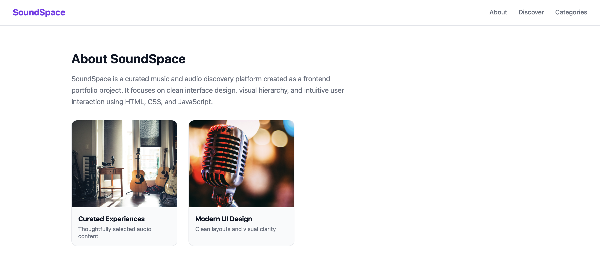

Soundspace

Soundspace is a front-end music browsing interface focused on clean UI interactions and dynamic content display.

Screenshots

Tech Stack
- HTML
- CSS
- JavaScript

Features
- Browse music content
- View detailed pages
- Interactive UI behavior

Notes
This is a front-end focused project.

